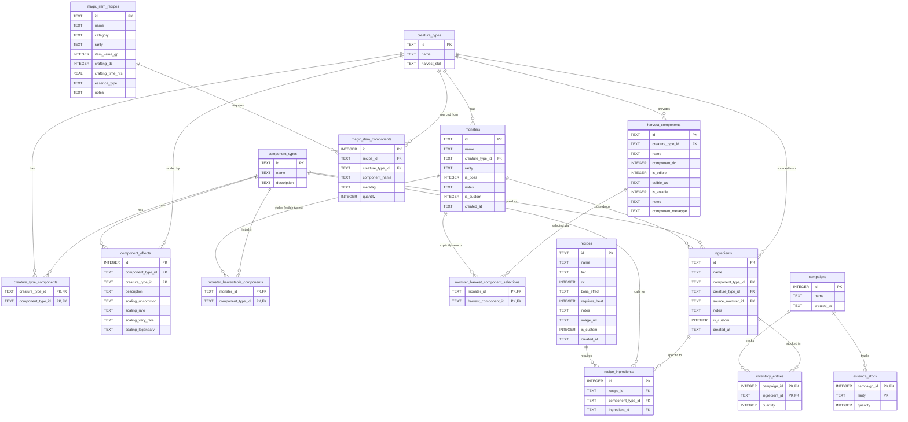

# Database Schema — cooking-rules

```mermaid
erDiagram

  %% ── Reference ───────────────────────────────────────────────

  creature_types {
    TEXT id PK
    TEXT name
    TEXT harvest_skill
  }

  component_types {
    TEXT id PK
    TEXT name
    TEXT description
  }

  creature_type_components {
    TEXT creature_type_id PK,FK
    TEXT component_type_id PK,FK
  }

  component_effects {
    INTEGER id PK
    TEXT component_type_id FK
    TEXT creature_type_id FK
    TEXT description
    TEXT scaling_uncommon
    TEXT scaling_rare
    TEXT scaling_very_rare
    TEXT scaling_legendary
  }

  %% ── Monsters ────────────────────────────────────────────────

  monsters {
    TEXT    id PK
    TEXT    name
    TEXT    creature_type_id FK
    TEXT    rarity
    INTEGER is_boss
    TEXT    notes
    INTEGER is_custom
    TEXT    created_at
  }

  monster_harvestable_components {
    TEXT monster_id PK,FK
    TEXT component_type_id PK,FK
  }

  monster_harvest_component_selections {
    TEXT monster_id PK,FK
    TEXT harvest_component_id PK,FK
  }

  %% ── Ingredients & Recipes ───────────────────────────────────

  ingredients {
    TEXT    id PK
    TEXT    name
    TEXT    component_type_id FK
    TEXT    creature_type_id FK
    TEXT    source_monster_id FK
    TEXT    notes
    INTEGER is_custom
    TEXT    created_at
  }

  recipes {
    TEXT    id PK
    TEXT    name
    TEXT    tier
    INTEGER dc
    TEXT    boss_effect
    INTEGER requires_heat
    TEXT    notes
    TEXT    image_url
    INTEGER is_custom
    TEXT    created_at
  }

  recipe_ingredients {
    INTEGER id PK
    TEXT    recipe_id FK
    TEXT    component_type_id FK
    TEXT    ingredient_id FK
  }

  %% ── Harvesting & Crafting ───────────────────────────────────

  harvest_components {
    TEXT    id PK
    TEXT    creature_type_id FK
    TEXT    name
    INTEGER component_dc
    INTEGER is_edible
    TEXT    edible_as
    INTEGER is_volatile
    TEXT    notes
    TEXT    component_metatype
  }

  magic_item_recipes {
    TEXT    id PK
    TEXT    name
    TEXT    category
    TEXT    rarity
    INTEGER item_value_gp
    INTEGER crafting_dc
    REAL    crafting_time_hrs
    TEXT    essence_type
    TEXT    notes
  }

  magic_item_components {
    INTEGER id PK
    TEXT    recipe_id FK
    TEXT    creature_type_id FK
    TEXT    component_name
    TEXT    metatag
    INTEGER quantity
  }

  %% ── Campaign / User Data ────────────────────────────────────

  campaigns {
    INTEGER id PK
    TEXT    name
    TEXT    created_at
  }

  inventory_entries {
    INTEGER campaign_id PK,FK
    TEXT    ingredient_id PK,FK
    INTEGER quantity
  }

  essence_stock {
    INTEGER campaign_id PK,FK
    TEXT    rarity PK
    INTEGER quantity
  }

  %% ── Relations ───────────────────────────────────────────────

  creature_types ||--o{ monsters : "has"
  creature_types ||--o{ creature_type_components : "has"
  component_types ||--o{ creature_type_components : "has"
  component_types ||--o{ component_effects : "has"
  creature_types  ||--o{ component_effects : "scaled by"

  monsters ||--o{ monster_harvestable_components : "yields (edible types)"
  component_types ||--o{ monster_harvestable_components : "listed in"

  monsters ||--o{ monster_harvest_component_selections : "explicitly selects"
  harvest_components ||--o{ monster_harvest_component_selections : "selected via"

  creature_types ||--o{ harvest_components : "provides"

  monsters ||--o{ ingredients : "boss-drops"
  component_types ||--o{ ingredients : "typed as"
  creature_types  ||--o{ ingredients : "sourced from"

  recipes ||--o{ recipe_ingredients : "requires"
  component_types ||--o{ recipe_ingredients : "calls for"
  ingredients     ||--o{ recipe_ingredients : "specific to"

  magic_item_recipes ||--o{ magic_item_components : "requires"
  creature_types     ||--o{ magic_item_components : "sourced from"

  campaigns ||--o{ inventory_entries : "tracks"
  campaigns ||--o{ essence_stock : "tracks"
  ingredients ||--o{ inventory_entries : "stocked in"
```
